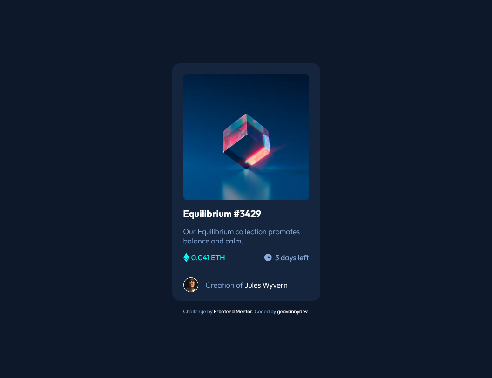

# Frontend Mentor - NFT preview card component solution

This is a solution to the [NFT preview card component challenge on Frontend Mentor](https://www.frontendmentor.io/challenges/nft-preview-card-component-SbdUL_w0U). Frontend Mentor challenges help you improve your coding skills by building realistic projects. 

## Overview

### Screenshot

### Links

- Solution URL: [GitHub](https://github.com/geovannydev/QR-code-component)
- Live Site URL: [Netlify](https://)

## My process

### Built with

- HTML5
- CSS
- Flexbox
- Mobile-first workflow

## Author

- Website - [Geovannydev](https://geovannydev.me)
- Frontend Mentor - [@yourusername](https://www.frontendmentor.io/profile/geovannydev)
- Twitter - [@geovannydev](https://www.twitter.com/geovannydev)
